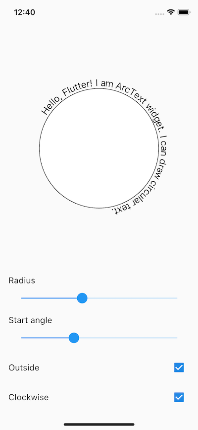

# Flutter Arc Text

Renders text along the arc.



## Basic usage

```dart
class MyApp extends StatelessWidget {
  @override
  Widget build(BuildContext context) => ArcText(
        radius: 100,
        text: 'Hello, Flutter!',
        textStyle: TextStyle(fontSize: 18, color: Colors.black),
        startAngle: -pi / 2,
      );
}
```

## Example

See [example](example) project.
